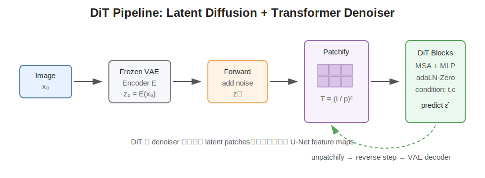
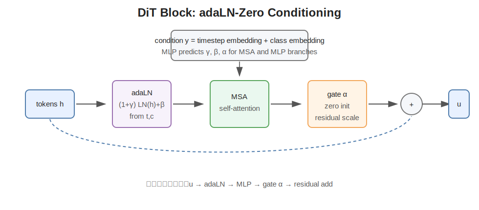

# DiT: Scalable Diffusion Models with Transformers

> **作者**：William Peebles, Saining Xie
>
> **机构**：UC Berkeley, Meta AI / FAIR
>
> **发布时间**：arXiv: 2022-12-19；ICCV 2023
>
> **论文链接**：[arXiv](https://arxiv.org/abs/2212.09748) | [项目主页](https://www.wpeebles.com/DiT) | [代码](https://github.com/facebookresearch/DiT)
>
> **分类标签**：`Diffusion Transformer` `DiT` `Latent Diffusion` `Vision Transformer` `Image Generation` `Scaling Law`

---

## 效果与结构图

DiT 的核心不是提出新的扩散概率公式，而是把扩散模型里常见的 U-Net denoiser 换成一个更接近 ViT 的 Transformer denoiser，并系统研究它的 scaling behavior。

DiT block 最关键的设计是条件注入方式，论文比较了 in-context conditioning、cross-attention、adaLN 和 adaLN-Zero，最后发现 **adaLN-Zero** 最稳定、效果最好且计算开销低。

---

## 一句话总结

DiT 可以理解为“Latent Diffusion + Vision Transformer denoiser”：它把 noisy latent 切成 patch tokens，用 Transformer block 预测噪声或扩散模型所需的输出，并证明在 ImageNet class-conditional generation 上，Transformer denoiser 具备非常清晰的规模化收益。

---

## 一、问题与动机

### 1. 为什么要把 U-Net 换成 Transformer

早期高质量 diffusion model 大多使用 convolutional U-Net 作为 denoiser，例如 DDPM、ADM、LDM / Stable Diffusion 等。U-Net 的优势是强空间归纳偏置、局部细节恢复好、结构成熟，但也有一些问题：

- **架构不统一**：语言、视觉识别、多模态理解已经大量转向 Transformer，而 diffusion denoiser 仍主要是 U-Net；
- **scale 规律不够直接**：U-Net 的参数量、分辨率、通道宽度、attention 位置交织在一起，较难像 Transformer 一样形成清晰扩展路线；
- **跨模态扩展不够自然**：文本、图像、视频、音频都可以 token 化，Transformer 更适合统一建模 token 序列；
- **全局关系建模依赖额外 attention block**：U-Net 主要靠卷积和下采样建立感受野，而 Transformer 自带全局 self-attention。

DiT 的研究问题很直接：

> 如果把 diffusion model 的 denoising network 从 U-Net 换成标准 Transformer，会不会也像语言模型和 ViT 一样，随着计算量变大持续变好？

### 2. DiT 的关键结论

DiT 原论文的结论可以概括为三点：

- Transformer 可以作为 diffusion denoiser，并且不需要 U-Net 的强归纳偏置也能达到很强图像质量；
- DiT 的生成质量和 forward-pass Gflops 有明显相关性，模型越大、token 越多，FID 趋势越好；
- 最大的 DiT-XL/2 在 class-conditional ImageNet 256x256 上达到当时很强的 FID 2.27，说明 DiT 是一条可以 scale 的视觉生成路线。

---

## 二、核心方法

### 1. Latent diffusion setting

DiT 不是直接在像素空间做扩散，而是沿用 latent diffusion 的思路。先用一个冻结的 autoencoder 把图像压缩到 latent space：

$$
z_0 = E(x_0)
$$

其中 $x_0$ 是原始图像，$E$ 是 encoder。扩散模型不再学习 $p(x)$，而是学习 latent 的生成分布 $p(z)$。生成完成后，再用 decoder 还原图像：

$$
\hat{x}_0 = D(\hat{z}_0)
$$

这样做的好处是：

- latent 空间分辨率更低，计算量更小；
- 保留主要语义和视觉结构；
- 可以把高分辨率图像生成变成更可控的 latent denoising 问题；
- 方便把 latent 当作二维特征图切成 patch tokens。

### 2. Diffusion formulation

DiT 使用标准 Gaussian diffusion formulation。正向加噪过程为：

$$
q(z_t \mid z_0)
=
\mathcal{N}
\left(
z_t;
\sqrt{\bar{\alpha}_t}z_0,
(1-\bar{\alpha}_t)I
\right)
$$

等价重参数化为：

$$
z_t
=
\sqrt{\bar{\alpha}_t}z_0
+
\sqrt{1-\bar{\alpha}_t}\epsilon,
\quad
\epsilon \sim \mathcal{N}(0,I)
$$

模型学习反向过程：

$$
p_\theta(z_{t-1}\mid z_t)
=
\mathcal{N}
\left(
z_{t-1};
\mu_\theta(z_t,t,c),
\Sigma_\theta(z_t,t,c)
\right)
$$

其中 $c$ 是 class condition。最常见的简化训练目标是预测噪声：

$$
\mathcal{L}_{\text{simple}}
=
\mathbb{E}_{z_0,\epsilon,t,c}
\left[
\left\|
\epsilon
-
\epsilon_\theta(z_t,t,c)
\right\|_2^2
\right]
$$

DiT 也沿用 improved DDPM 的做法，让模型同时预测噪声和 covariance 相关输出，用 simple loss 训练噪声预测，用 variational lower bound 中的 KL 项训练 learned variance。

### 3. Patchify：把 noisy latent 变成 token 序列

设 noisy latent 的空间形状为：

$$
z_t \in \mathbb{R}^{I \times I \times C}
$$

DiT 使用 patch size $p$，把 latent 切成 $p \times p$ 的 patches。token 数为：

$$
T
=
\left(
\frac{I}{p}
\right)^2
$$

每个 patch 被 flatten 后通过线性层映射到 hidden dimension $d$：

$$
x_i
=
W_{\text{patch}}
\cdot
\text{flatten}(z_t^{(i)})
+
b_{\text{patch}}
$$

然后加上二维位置编码：

$$
h_i^{(0)}
=
x_i + e_i^{\text{pos}}
$$

直觉上：

- $p$ 越小，token 越多，细节更充分，但 self-attention 计算更贵；
- $p$ 越大，token 越少，计算更省，但空间细节更粗；
- DiT-XL/2 中的 `/2` 就表示 patch size 为 2。

由于 self-attention 复杂度近似为：

$$
\mathcal{O}(T^2 d)
$$

当 patch size 减半时，token 数会变成 4 倍，attention 部分计算会显著增加。

### 4. Transformer denoiser

每个 DiT block 大体保留 ViT / Transformer block 的结构：LayerNorm、multi-head self-attention、MLP 和 residual connection。

普通 self-attention 写作：

$$
Q = HW_Q,\quad K = HW_K,\quad V = HW_V
$$

$$
\text{Attention}(Q,K,V)
=
\text{softmax}
\left(
\frac{QK^T}{\sqrt{d_k}}
\right)V
$$

Transformer block 的简化形式为：

$$
H'
=
H
+
\text{MSA}(\text{LN}(H))
$$

$$
H^{\text{out}}
=
H'
+
\text{MLP}(\text{LN}(H'))
$$

DiT 的不同之处在于：扩散模型必须知道当前 timestep $t$ 和条件 $c$，所以 Transformer block 需要条件注入机制。

### 5. 条件注入方式：四种 DiT block

DiT 论文比较了四种 conditioning 方式：

| 方式 | 做法 | 特点 |
| --- | --- | --- |
| In-context conditioning | 把 timestep token 和 class token 拼到 image token 序列中 | 最接近 LLM 的上下文拼接 |
| Cross-attention | image tokens 对 condition tokens 做 cross-attention | 表达力强，但计算更贵 |
| adaLN | 用条件向量生成 LayerNorm 的 scale / shift | 计算开销小 |
| adaLN-Zero | 在 adaLN 基础上增加 residual scaling，并零初始化 | 最稳定，论文中表现最好 |

### 6. adaLN 与 adaLN-Zero

先把 timestep embedding 和 class embedding 合成条件向量：

$$
y = e_t + e_c
$$

adaLN 根据条件 $y$ 预测 LayerNorm 的调制参数：

$$
(\gamma, \beta)
=
f(y)
$$

调制后的 LayerNorm 可以写成：

$$
\text{adaLN}(h,y)
=
(1+\gamma(y))
\odot
\text{LN}(h)
+
\beta(y)
$$

adaLN-Zero 进一步为 MSA 和 MLP residual branch 预测 gate / scale 参数 $\alpha$：

$$
u
=
h
+
\alpha_{\text{msa}}(y)
\odot
\text{MSA}
\left(
\text{adaLN}_{\text{msa}}(h,y)
\right)
$$

$$
h^{\text{out}}
=
u
+
\alpha_{\text{mlp}}(y)
\odot
\text{MLP}
\left(
\text{adaLN}_{\text{mlp}}(u,y)
\right)
$$

并且把输出 $\alpha$ 的最后一层初始化为 0：

$$
\alpha_{\text{msa}}(y) \approx 0,\quad
\alpha_{\text{mlp}}(y) \approx 0
$$

这样每个 block 在训练一开始近似为 identity mapping：

$$
h^{\text{out}} \approx h
$$

这个设计对深层 Transformer diffusion model 很重要：模型一开始不会把 noisy latent token 乱改，而是在训练中逐渐学会如何把条件信息注入到 denoising 过程里。

### 7. 输出层与 unpatchify

Transformer 输出 token 后，需要把 token 还原为 latent feature map。设每个输出 token 预测一个 patch 的 diffusion 输出：

$$
\hat{y}_i
=
W_{\text{out}} h_i^{(L)}
+
b_{\text{out}}
$$

然后通过 unpatchify 还原成：

$$
\hat{\epsilon}_\theta(z_t,t,c)
\in
\mathbb{R}^{I \times I \times C}
$$

如果模型同时预测 variance，输出通道会相应增加。之后就可以按 DDPM / DDIM / sampler 的公式逐步采样。

### 8. Classifier-free guidance

DiT 是 class-conditional generation，所以也使用 classifier-free guidance。训练时随机把 class condition dropout 成 null condition $\emptyset$。采样时组合条件预测和无条件预测：

$$
\hat{\epsilon}_\theta(z_t,c)
=
\epsilon_\theta(z_t,\emptyset)
+
s
\left(
\epsilon_\theta(z_t,c)
-
\epsilon_\theta(z_t,\emptyset)
\right)
$$

其中 $s$ 是 guidance scale。直觉上：

- $s=1$：接近普通条件采样；
- $s>1$：更强调 class condition，图像更贴合类别，但过大可能降低多样性或产生伪影。

---

## 三、实验结果与重要结论

### 1. DiT 的 scaling 结论

论文最重要的实验不是“某个模型参数更大”，而是证明：

> DiT 的 forward-pass Gflops 和 sample quality 存在稳定相关性。

影响 Gflops 的主要因素包括：

- 模型深度：block 数 $N$；
- 模型宽度：hidden size $d$；
- attention heads 数；
- patch size $p$，也就是 token 数 $T$。

论文中的基本模型族包括：

| 模型 | 层数 | hidden size | heads | 含义 |
| --- | ---: | ---: | ---: | --- |
| DiT-S | 12 | 384 | 6 | small |
| DiT-B | 12 | 768 | 12 | base |
| DiT-L | 24 | 1024 | 16 | large |
| DiT-XL | 28 | 1152 | 16 | extra large |

命名中的 `/2`、`/4`、`/8` 表示 patch size，例如 DiT-XL/2 就是 extra-large backbone + patch size 2。

### 2. 条件注入消融

论文比较了 in-context、cross-attention、adaLN 和 adaLN-Zero。结论是：

- in-context conditioning 简单，但效果不如更有针对性的调制；
- cross-attention 表达力强，但会引入额外计算；
- adaLN 性价比较高；
- adaLN-Zero 最稳定，训练曲线和最终 FID 表现最好。

这个结果对后续模型很有启发：在 diffusion Transformer 里，条件不一定必须通过 cross-attention 注入，也可以通过 normalization modulation 进入每个 block。

### 3. ImageNet 结果

在 class-conditional ImageNet generation 上，DiT-XL/2 达到了当时很强的结果：

- ImageNet 256x256：FID 2.27；
- ImageNet 512x512：也超过了此前很多 U-Net-based diffusion baseline。

这说明 DiT 不只是“能跑”，而是可以作为高质量图像生成的核心 backbone。

### 4. 和后续工作的关系

DiT 之后，Diffusion Transformer 很快成为视觉生成的重要路线：

| 工作 | 关系 |
| --- | --- |
| U-ViT | 与 DiT 同时期探索 ViT backbone，用 long skip connection 强化生成 |
| MDT / MDTv2 | 在 DiT 基础上引入 masked latent modeling，提高上下文学习效率 |
| PixArt-alpha / PixArt-Sigma | 把 DiT 路线推进到低成本、高分辨率 text-to-image 训练 |
| SiT | 在 DiT backbone 上研究 interpolant / flow formulation |
| Stable Diffusion 3 / MMDiT | 使用 transformer / rectified flow 路线做高分辨率 T2I |
| Sora | 官方技术报告中使用 diffusion transformer 处理 spacetime latent patches |
| Latte / Open-Sora Plan | 把 DiT 思路扩展到视频 latent tokens |

---

## 四、局限性与未来方向

### 1. 计算复杂度

Transformer 的 self-attention 对 token 数是二次复杂度：

$$
\mathcal{O}(T^2)
$$

当图像分辨率提高、patch size 变小，或者扩展到视频时，token 数会迅速变大。视频里还会增加时间维度：

$$
T_{\text{video}}
=
T_{\text{frames}}
\times
\frac{H}{p}
\times
\frac{W}{p}
$$

这让高分辨率图像、长视频和多视角生成都面临显存和计算瓶颈。

### 2. 局部归纳偏置减少

U-Net 天生有卷积和多尺度结构，适合局部纹理、边缘和细节恢复。DiT 更通用，但也更依赖：

- 数据规模；
- 模型规模；
- 位置编码；
- patch size 选择；
- 训练策略和条件注入。

如果数据不足或模型太小，Transformer 的优势可能发挥不出来。

### 3. 条件控制仍需扩展

原始 DiT 主要做 class-conditional ImageNet generation。实际应用往往需要：

- 文本条件；
- 图像参考；
- ControlNet 类结构条件；
- mask / depth / pose / bbox；
- 多图、多轮编辑上下文。

所以后续工作通常会在 DiT backbone 上加入 cross-attention、多模态 token mixing、control branch 或 flow matching。

### 4. 视频和 3D 场景的挑战

DiT 的 token 化思想天然适合视频和 3D，但真正扩展时会遇到：

- 长时序一致性；
- 物体永久性；
- 运动和物理规律；
- 多镜头角色一致；
- 超长 token sequence 的计算成本。

Sora、Latte、Open-Sora Plan 等工作都可以看作是在尝试把 DiT 的空间 patch 思路扩展为 spatiotemporal patch 思路。

---

## 五、个人思考

### 1. DiT 的真正贡献是“把 diffusion 带入 Transformer scaling 语境”

DDPM 解决了“如何从噪声生成数据”，LDM 解决了“在哪个空间扩散更省”，DiT 解决的是“denoiser 能不能统一到 Transformer 并 scale”。这使得视觉生成模型可以更自然地继承 LLM / ViT 时代的经验：更大模型、更大数据、更统一的 token 表示、更清晰的 scaling law。

### 2. DiT 不是简单把 U-Net 换成 Transformer

如果只是把 latent patchify 后扔进 Transformer，模型未必稳定。DiT 里真正关键的工程点包括：

- latent space 降低计算量；
- patch size 控制 token 数和 Gflops；
- adaLN-Zero 稳定深层条件注入；
- classifier-free guidance 提升条件采样质量；
- 用 Gflops 而不是只用参数量分析 scaling。

### 3. 对服装生成 / ConceptCloth 类任务的启发

如果关注服装、虚拟试穿、产品图生成，DiT 的启发很明显：

- 服装图像可以被看成 patch token 序列；
- reference image、garment mask、pose、text prompt 都可以转成条件 token 或调制信号；
- Transformer 更适合跨区域建模，例如衣领、袖口、纹理、人物姿态之间的长距离关系；
- 但服装任务对局部几何和纹理保真要求高，可能需要结合 segmentation、dense pose、UV map、material-aware loss 或 identity preservation。

### 4. 后续值得关注的问题

- 如何降低高分辨率 DiT 的 attention 复杂度；
- DiT 是否需要重新引入多尺度结构；
- text/image/video tokens 如何统一建模；
- flow matching 与 DiT backbone 是否会成为高质量生成的默认组合；
- 多轮编辑和 reference consistency 如何在 DiT 中更稳地实现。

---

## 参考

- Peebles and Xie, 2023. [Scalable Diffusion Models with Transformers](https://arxiv.org/abs/2212.09748)：DiT 原论文，系统研究 Transformer denoiser 的 scaling behavior。
- Peebles and Xie. [DiT Project Page](https://www.wpeebles.com/DiT)：项目主页，包含论文、代码和示例。
- facebookresearch. [DiT GitHub Repository](https://github.com/facebookresearch/DiT)：官方代码实现。
- Ho et al., 2020. [Denoising Diffusion Probabilistic Models](https://arxiv.org/abs/2006.11239)：DDPM 基础。
- Nichol and Dhariwal, 2021. [Improved Denoising Diffusion Probabilistic Models](https://arxiv.org/abs/2102.09672)：learned variance、improved DDPM 训练细节。
- Dhariwal and Nichol, 2021. [Diffusion Models Beat GANs on Image Synthesis](https://arxiv.org/abs/2105.05233)：强 U-Net diffusion baseline。
- Rombach et al., 2022. [High-Resolution Image Synthesis with Latent Diffusion Models](https://arxiv.org/abs/2112.10752)：latent diffusion 框架，是 DiT latent-space 设定的重要基础。
- Dosovitskiy et al., 2020. [An Image is Worth 16x16 Words](https://arxiv.org/abs/2010.11929)：ViT 和 patch token 化的基础。
- Bao et al., 2022. [All are Worth Words: A ViT Backbone for Diffusion Models](https://arxiv.org/abs/2209.12152)：U-ViT，与 DiT 同期探索 ViT denoiser。
- Gao et al., 2023. [MDTv2: Masked Diffusion Transformer is a Strong Image Synthesizer](https://arxiv.org/abs/2303.14389)：在 DiT 上加入 masked latent modeling。
- Chen et al., 2023. [PixArt-alpha](https://arxiv.org/abs/2310.00426)：低成本训练 text-to-image diffusion transformer。
- Chen et al., 2024. [PixArt-Sigma](https://arxiv.org/abs/2403.04692)：弱到强训练和高分辨率 DiT。
- Ma et al., 2024. [SiT](https://arxiv.org/abs/2401.08740)：在 DiT backbone 上研究 flow / diffusion interpolant formulation。
- Esser et al., 2024. [Scaling Rectified Flow Transformers for High-Resolution Image Synthesis](https://arxiv.org/abs/2403.03206)：Stable Diffusion 3 / MMDiT 相关的 rectified-flow transformer 路线。
- OpenAI, 2024. [Video generation models as world simulators](https://openai.com/index/video-generation-models-as-world-simulators/)：Sora 技术报告，展示 diffusion transformer 在视频 spacetime patches 上的扩展。
- Ma et al., 2024. [Latte: Latent Diffusion Transformer for Video Generation](https://arxiv.org/abs/2401.03048)：DiT 思路在视频生成中的扩展。
