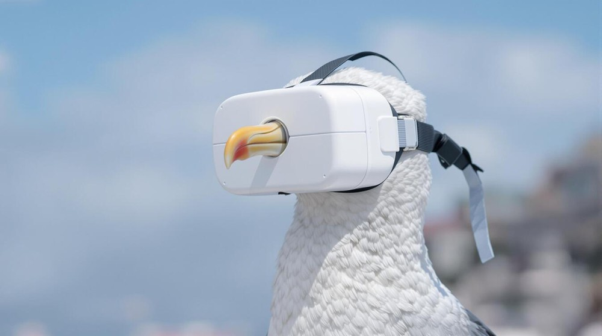

# FLUX.1 Kontext: Flow Matching for In-Context Image Generation and Editing in Latent Space

> **作者**：Black Forest Labs, Stephen Batifol, Andreas Blattmann, Frederic Boesel, Saksham Consul, Cyril Diagne, Tim Dockhorn, Jack English, Zion English, Patrick Esser, Sumith Kulal, Kyle Lacey, Yam Levi, Cheng Li, Dominik Lorenz, Jonas Muller, Dustin Podell, Robin Rombach, Harry Saini, Axel Sauer, Luke Smith
>
> **机构**：Black Forest Labs
>
> **发布时间**：2025年6月，arXiv v1: 2025-06-17，v2: 2025-06-24
>
> **论文链接**：[arXiv](https://arxiv.org/abs/2506.15742) | [项目主页](https://bfl.ai/models/flux-kontext) | [代码](https://github.com/black-forest-labs/flux) | [模型权重](https://huggingface.co/black-forest-labs/FLUX.1-Kontext-dev)
>
> **分类标签**：`Flow Matching` `DiT` `Image Editing` `In-Context Generation` `Multimodal Generation`

---

## 效果展示

论文的核心不是单纯做一个更强的 T2I，而是把“文本生成图像”和“给定图像上下文后的编辑 / 迁移 / 引用生成”统一到同一个 flow matching transformer 里。

---

## 一句话总结

FLUX.1 Kontext 可以看作是 FLUX.1 的 in-context image generation / editing 版本：它把参考图像 latent tokens、目标图像 noisy latent tokens 和文本 tokens 放进同一个 Transformer 框架里，用 flow matching 训练一个既能文生图、又能图像编辑、角色保持、风格参考和文字编辑的统一模型。

---

## 一、问题与动机

### 1. 现有图像编辑模型的问题

传统 image editing 方法往往会把任务拆得很细：inpainting、style transfer、image variation、instruction editing、subject-driven generation 等分别设计模型或额外条件模块。这会带来几个问题：

- **任务接口不统一**：局部编辑、全局编辑、角色参考、风格参考和文字编辑通常需要不同 pipeline。
- **多轮编辑容易漂移**：人物身份、物体结构、品牌元素、文字样式在连续编辑后会逐步丢失。
- **推理延迟偏高**：很多 diffusion / flow 模型需要较多 denoising steps，不利于交互式创作。
- **评测不够贴近日常编辑需求**：早期 benchmark 经常依赖合成图像、GPT 生成指令或较窄任务分布，无法充分反映真实用户的编辑需求。

### 2. 本文的目标

作者希望训练一个统一模型，输入可以是：

- 纯文本：退化为 text-to-image generation；
- 图像 + 文本：做 instruction-based image editing；
- 参考图像 + 文本：做 character reference / style reference / visual cue editing；
- 多轮图像上下文：支持 iterative workflow。

这篇论文比较重要的点在于：它没有引入复杂的外部控制网络，而是采用非常直接的 **sequence concatenation**。也就是说，把参考图像 token 当作上下文 token 拼到视觉 token 序列里，让 Transformer 自己通过 attention 学会“读图”和“改图”。

---

## 二、核心方法

### 1. 基础架构：从 FLUX.1 继承的 rectified flow transformer

FLUX.1 本身是 latent-space rectified flow Transformer。整体流程可以抽象为：

1. 使用冻结的 autoencoder 把图像编码到 latent space；
2. 把 latent 切成 image tokens；
3. 文本通过 text encoder 变成 text tokens；
4. Transformer 在 image tokens 和 text tokens 之间做 attention mixing；
5. 最后只保留 image tokens，通过 decoder 还原成图像。

FLUX.1 的 Transformer 结构包含 double-stream blocks 和 single-stream blocks：

- **Double-stream blocks**：图像 token 和文本 token 使用不同参数，但通过拼接后的 attention 进行信息交互；
- **Single-stream blocks**：后半段把图像 token 和文本 token 拼成统一序列继续建模；
- 输出阶段丢弃文本 token，只解码图像 token。

Kontext 在这个基础上增加了“图像上下文”的输入路径。

### 2. Token sequence construction：最关键的设计

设：

- $x_1$：目标图像 latent；
- $x_c$：上下文图像 latent，可以为空；
- $y$：文本 prompt；
- $\epsilon$：噪声；
- $x_t$：时间 $t$ 上的 noisy latent。

训练时，目标图像和上下文图像都先经过同一个冻结 VAE / autoencoder 编码成 latent tokens。不同于把参考图像和目标图像在 channel 维度硬拼接，Kontext 采用：

$$
\text{visual sequence} = [\text{target image tokens}; \text{context image tokens}]
$$

这个设计有几个优点：

- 可以天然支持不同分辨率、不同长宽比的输入和输出；
- 理论上可以扩展到多个参考图；
- 不破坏目标图像和上下文图像各自的空间结构；
- 让模型通过 attention 自己学习 context 与 target 之间的对应关系。

作者也提到，他们尝试过 channel-wise concatenation，但初步实验效果更差。这说明在 DiT 架构里，“把图像视作 token 序列再交给 attention”比“在 latent channel 上强行对齐”更符合 Transformer 的归纳偏置。

### 3. 3D RoPE：区分目标图像和上下文图像

如果直接拼接 tokens，模型需要知道哪些 token 来自目标图像，哪些来自上下文图像。Kontext 使用 3D RoPE positional embedding 来编码：

- 目标图像 token 使用正常的空间位置；
- 上下文图像 token 在一个“虚拟时间维度”上加固定 offset；
- 每张图内部仍然保留自己的空间布局。

直觉上，这相当于告诉模型：“这些 token 都是图像块，但它们处在不同的上下文层。”这样既能避免 target/context 混淆，又保留了二者可互相注意力交互的能力。

### 4. Rectified-flow objective

训练目标沿用 rectified flow matching。可以把 noisy latent 写成从噪声 $\epsilon$ 到真实 latent $x_1$ 的线性插值：

$$
x_t = (1 - t)\epsilon + t x_1
$$

模型学习预测从 $x_t$ 指向 $x_1$ 的速度场：

$$
\mathcal{L}_{\text{FM}} =
\mathbb{E}_{x_1, x_c, y, \epsilon, t}
\left[
\left\|
v_\theta(x_t, t, x_c, y) - (x_1 - \epsilon)
\right\|_2^2
\right]
$$

这里 $x_c$ 可以为空。当没有上下文图像时，模型退化为普通 text-to-image；当存在上下文图像时，模型就学习根据图像和文本共同决定目标图像。

### 5. Adversarial Diffusion Distillation

标准 flow / diffusion 采样常常需要几十到上百步。为了提升交互速度，作者使用 latent adversarial diffusion distillation，目标是：

- 减少采样步数；
- 降低 serving 成本；
- 保持或提升视觉质量；
- 减少 guidance 带来的过饱和、伪影等问题。

论文中提到：

- `FLUX.1 Kontext [pro]`：先用 flow objective 训练，再进行 LADD；
- `FLUX.1 Kontext [dev]`：蒸馏到 12B diffusion transformer，且主要优化 image-to-image / editing 任务；
- `[max]`：更偏高质量和更强生成能力的版本。

---

## 三、实验结果

### 1. KontextBench

作者提出了一个新的评测集 **KontextBench**，用于覆盖更真实的 in-context image generation / editing 场景：

| 类别 | 数量 | 关注点 |
| --- | ---: | --- |
| Local instruction editing | 416 | 局部对象、属性、区域修改 |
| Global instruction editing | 262 | 整体场景、风格、构图变化 |
| Text editing | 92 | 图中文字替换与排版保持 |
| Style reference | 63 | 参考图风格迁移到新语义 |
| Character reference | 193 | 人物 / 物体身份保持 |
| **总计** | **1026** | 来自 108 张 base images 的真实使用场景 |

这个 benchmark 的价值在于，它不是只问“哪张图更好看”，而是把图像编辑拆成更接近应用需求的能力维度：遵循指令、保持身份、局部可控、文字正确、风格一致、速度可用。

### 2. Image-to-image 结果

论文结论可以概括为：

- `FLUX.1 Kontext [pro]` 在 KontextBench 的多项编辑任务中位于第一梯队；
- 在 text editing、local editing 和 character reference 上表现尤其强；
- 在 global editing 和 style reference 上也有竞争力，但论文承认某些闭源系统在部分维度仍然更强；
- 相比 GPT-Image-1 等闭源模型，Kontext 的关键优势之一是低延迟，论文称在某些比较中速度可高一个数量级。

### 3. Text-to-image 结果

作者对 T2I 的评价比较有意思：他们指出传统“用户偏好”评测容易偏向一种典型 AI 审美，例如过饱和、主体居中、强 bokeh、风格同质化。论文把这种倾向称为 **bakeyness**。

因此他们把 T2I 拆成多个维度：

- prompt following；
- aesthetic；
- realism；
- typography accuracy；
- inference speed。

结论是 FLUX.1 Kontext 在这些维度上更均衡，并且相对 FLUX1.1 [pro] 有整体提升。

### 4. 多轮编辑结果

多轮编辑是这篇文章最有应用价值的部分。作者比较了 FLUX.1 Kontext、GPT-Image-1、Runway Gen-4 等模型在连续编辑中的身份保持能力，并用 AuraFace embedding 的 cosine similarity 辅助评价人脸一致性。

从科研角度看，这个实验重要在于：单轮编辑好看不代表工作流可用。真正的内容生产经常是“先改姿态，再改表情，再改服装，再改背景”，模型必须在多次条件变化后仍保留关键 identity。

---

## 四、局限性与未来方向

论文自己提到的局限包括：

- **过多轮编辑仍会产生伪影**：多次迭代后图像质量会下降；
- **指令遵循并非完全可靠**：模型有时会忽略具体要求，或者误解空间关系；
- **蒸馏可能引入失真**：加速采样带来的 distillation artifacts 会影响保真度；
- **当前主要关注单张上下文图像**：虽然方法天然可扩展到多图输入，但论文实验主要集中在 single context image；
- **视频编辑尚未覆盖**：作者认为把这种 in-context editing 扩展到 video domain 是自然方向。

我认为还可以补充几个研究层面的限制：

- **benchmark 仍然依赖人类偏好判断**，不同平台、不同文化背景下的审美和编辑意图可能会有偏差；
- **文本编辑能力仍需要更细粒度指标**，例如字符级准确率、字体一致性、透视一致性；
- **上下文图像的“可引用对象”缺少显式结构化表示**，模型依赖 attention 隐式绑定对象，遇到多个相似对象时可能不稳定；
- **版权和身份保持的边界需要更清晰**，character reference 能力越强，越需要讨论授权、肖像和风格模仿问题。

---

## 五、个人思考

### 1. Kontext 的核心贡献不是“多一个编辑模型”，而是接口统一

这篇文章真正值得关注的是接口设计：把 text-to-image、image editing、character reference、style reference 都放进一个条件分布：

$$
p(x_{\text{target}} \mid y, x_{\text{context}})
$$

当 $x_{\text{context}}$ 为空时就是文生图；当它存在时就是图像上下文生成。这个形式非常干净，也符合大模型发展的趋势：尽量减少任务专用模块，把不同任务表达成同一个上下文建模问题。

### 2. Sequence concatenation 是一个很“Transformer-native”的选择

相比 ControlNet、IP-Adapter、LoRA 或 mask-specific editing pipeline，Kontext 更像是在说：如果 backbone 足够强，最自然的条件注入方式就是 token concatenation + attention。它的工程复杂度更低，但对训练数据规模、模型容量和位置编码设计提出更高要求。

这个思路和 LLM 的 in-context learning 很相似：不是专门为每个任务训练一个头，而是把条件样例放进上下文，让模型自己学会映射。

### 3. 对视觉生成研究的启发

我觉得后续可以从三个方向继续看：

- **多图上下文**：多参考人物、多物体、多风格融合会不会出现 token competition？
- **可控性增强**：能否结合 segmentation、depth、bbox 等结构化条件，让模型既有 in-context flexibility 又有精确控制？
- **长链编辑记忆**：多轮编辑是否应该保留历史 latent / attention memory，而不是每次只看上一张图？

### 4. 和 Concept/Cloth 类任务的联系

如果关注服装、产品图或虚拟试穿，Kontext 这类模型的启发很明显：它可以把“参考图中的身份 / 款式 / 材质”作为上下文，而不是训练一个非常任务专用的 pipeline。问题是服装领域往往要求几何结构更准、遮挡关系更细、纹理变形更可控，所以单纯的 in-context token 拼接可能还不够，需要和 human parsing、pose、depth 或 garment mask 结合。

---

## 参考

- Black Forest Labs, 2025. [FLUX.1 Kontext: Flow Matching for In-Context Image Generation and Editing in Latent Space](https://arxiv.org/abs/2506.15742)：本文主论文。
- Esser et al., 2024. [Scaling Rectified Flow Transformers for High-Resolution Image Synthesis](https://arxiv.org/abs/2403.03206)：FLUX.1 的基础 rectified flow transformer 方向。
- Brooks et al., 2023. [InstructPix2Pix](https://arxiv.org/abs/2211.09800)：早期 instruction-based image editing 基线。
- Rombach et al., 2022. [High-Resolution Image Synthesis with Latent Diffusion Models](https://arxiv.org/abs/2112.10752)：latent diffusion / autoencoder 视觉生成范式。
- Sauer et al., 2024. [Fast High-Resolution Image Synthesis with Latent Adversarial Diffusion Distillation](https://arxiv.org/abs/2403.12015)：用于理解 LADD 和加速采样。
