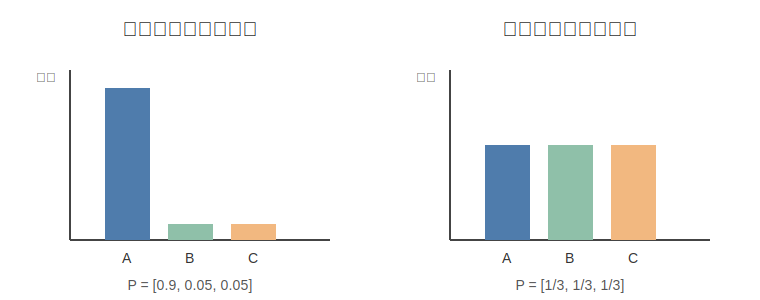

# Deep Learning Concepts: 深度学习基础概念

> **定位**：整理深度学习和机器学习中最底层、最常出现的概念，用比较通俗的语言连接公式、直觉、代码、应用场景和来源。
>
> **分类标签**：`Entropy` `Cross Entropy` `Softmax` `Likelihood` `Machine Learning Basics`

---

## 一句话总结

深度学习中的很多基础概念本质上都在回答三件事：数据有多不确定、模型给某个结果多大概率、以及怎样把概率和误差变成可以优化的 loss。

---

## 一、熵 Entropy

### 1. 它是什么

熵衡量一个概率分布的不确定性。一个事件越难预测，熵越大；一个事件几乎确定发生，熵越小。

**适用场景**：

- 衡量分类模型输出是否“很确定”；
- 决策树中选择信息增益大的特征；
- 强化学习中用 entropy bonus 鼓励探索；
- 分析语言模型输出分布是否过于集中或过于发散。

完整公式：

$$
H(P)
=
-
\sum_{i=1}^{n}
p_i
\log p_i
$$

如果使用 $\log_2$，单位是 bit；如果使用自然对数 $\ln$，单位是 nat。

### 2. 直觉图



左边分布很集中，几乎总是同一个结果，所以不确定性低；右边分布更均匀，结果更难猜，所以熵更高。

### 3. Python 代码

```python
import numpy as np

def entropy(probs):
    probs = np.asarray(probs, dtype=np.float64)
    eps = 1e-12
    probs = np.clip(probs, eps, 1.0)
    return -np.sum(probs * np.log2(probs))

print(entropy([0.9, 0.05, 0.05]))      # low entropy
print(entropy([1/3, 1/3, 1/3]))        # high entropy
```

### 4. 出处

- Shannon, 1948. A Mathematical Theory of Communication。

---

## 二、交叉熵 Cross Entropy

### 1. 它是什么

交叉熵衡量：真实分布是 $P$，但我们用模型分布 $Q$ 去编码或预测时，需要付出多少代价。

**适用场景**：

- 图像分类、文本分类、语音识别等监督分类任务；
- LLM 的 next-token prediction；
- 多模态模型中图文匹配或 token 分类相关任务；
- 判断模型有没有把概率分配给正确类别。

完整公式：

$$
H(P, Q)
=
-
\sum_{i=1}^{n}
P(i)
\log Q(i)
$$

在分类任务中，真实标签通常是 one-hot。如果真实类别是 $k$，交叉熵就变成：

$$
\mathcal{L}_{\text{CE}}
=
-
\log Q(k)
$$

### 2. 和熵、KL 的关系

$$
H(P, Q)
=
H(P)
+
D_{\text{KL}}(P \| Q)
$$

也就是说，交叉熵包含两部分：

- 真实分布本身的不确定性；
- 模型分布和真实分布之间的差距。

### 3. Python 代码

```python
import numpy as np

def cross_entropy(p, q):
    p = np.asarray(p, dtype=np.float64)
    q = np.asarray(q, dtype=np.float64)
    eps = 1e-12
    q = np.clip(q, eps, 1.0)
    return -np.sum(p * np.log(q))

print(cross_entropy([1, 0, 0], [0.8, 0.1, 0.1]))
print(cross_entropy([1, 0, 0], [0.1, 0.8, 0.1]))
```

### 4. 出处

- Shannon, 1948. A Mathematical Theory of Communication。
- Goodfellow et al., 2016. Deep Learning。

## 三、Logits 与 Softmax

### 1. Logits 是什么

Logits 是模型最后一层直接输出的未归一化分数。它们还不是概率，可以是任意实数。

**适用场景**：

- 分类模型最后一层输出；
- 语言模型 LM head 对整个词表打分；
- 温度采样、top-k、top-p 等生成策略都会先操作 logits 或 softmax 概率；
- 校准模型置信度时也会分析 logits / probabilities。

Softmax 把 logits 转成概率分布：

$$
p_i
=
\frac{
\exp(z_i)
}{
\sum_{j=1}^{C}
\exp(z_j)
}
$$

其中 $z_i$ 是第 $i$ 类的 logit，$C$ 是类别数。

### 2. 直觉解释

- logit 越大，对应类别概率越高；
- softmax 会让所有概率加起来等于 1；
- 如果某个 logit 远大于其他 logit，softmax 会非常偏向它。

### 3. Python 代码

```python
import numpy as np

def softmax(logits):
    logits = np.asarray(logits, dtype=np.float64)
    shifted = logits - np.max(logits)
    exp_values = np.exp(shifted)
    return exp_values / np.sum(exp_values)

print(softmax([2.0, 1.0, 0.1]))
```

### 4. 出处

- Bridle, 1990. Probabilistic Interpretation of Feedforward Classification Network Outputs。
- Goodfellow et al., 2016. Deep Learning。

---

## 四、似然 Likelihood

### 1. 它是什么

概率和似然写法很像，但视角不同：

- 概率：参数固定，看数据出现的概率；
- 似然：数据固定，看哪组参数更能解释这些数据。

**适用场景**：

- 最大似然估计 MLE；
- 语言模型训练中的负对数似然；
- 统计建模中比较不同参数解释数据的能力；
- 生成模型中衡量模型是否给真实数据较高概率。

给定数据集 $\mathcal{D} = \{x_1, x_2, ..., x_N\}$，似然函数为：

$$
L(\theta)
=
p(\mathcal{D} \mid \theta)
=
\prod_{i=1}^{N}
p(x_i \mid \theta)
$$

实际优化时通常用对数似然：

$$
\log L(\theta)
=
\sum_{i=1}^{N}
\log p(x_i \mid \theta)
$$

最大似然估计：

$$
\theta^*
=
\arg\max_{\theta}
\sum_{i=1}^{N}
\log p(x_i \mid \theta)
$$

深度学习中经常最小化负对数似然：

$$
\mathcal{L}_{\text{NLL}}
=
-
\sum_{i=1}^{N}
\log p(x_i \mid \theta)
$$

### 2. Python 代码

```python
import numpy as np

def negative_log_likelihood(probs):
    probs = np.asarray(probs, dtype=np.float64)
    eps = 1e-12
    probs = np.clip(probs, eps, 1.0)
    return -np.sum(np.log(probs))

# 假设模型给 3 个真实样本分配的概率分别如下
print(negative_log_likelihood([0.8, 0.6, 0.9]))
```

### 3. 出处

- Fisher, 1922. On the Mathematical Foundations of Theoretical Statistics。
- Bishop, 2006. Pattern Recognition and Machine Learning。

---

## 五、KL Divergence

### 1. 它是什么

KL Divergence 衡量两个概率分布之间的差异。它回答的问题是：如果真实分布是 $P$，但我用 $Q$ 来近似，会额外付出多少信息代价。

完整公式：

$$
D_{\text{KL}}(P \| Q)
=
\sum_i
P(i)
\log
\frac{P(i)}{Q(i)}
$$

**适用场景**：

- VAE 中约束 latent distribution 接近先验分布；
- 知识蒸馏中让学生模型靠近老师模型；
- RLHF / PPO 中限制新策略不要偏离参考模型太远；
- 比较两个分类器输出分布是否接近。

### 2. Python 代码

```python
import numpy as np

def kl_divergence(p, q):
    p = np.asarray(p, dtype=np.float64)
    q = np.asarray(q, dtype=np.float64)
    eps = 1e-12
    p = np.clip(p, eps, 1.0)
    q = np.clip(q, eps, 1.0)
    return np.sum(p * np.log(p / q))
```

---

## 六、概念之间的关系

| 概念 | 一句话理解 | 常出现位置 |
| --- | --- | --- |
| Entropy | 分布自身有多不确定 | 信息论、决策树、RL |
| Cross Entropy | 用模型分布预测真实分布的代价 | 分类、语言模型 |
| KL Divergence | 两个分布之间的额外信息代价 | VAE、蒸馏、RLHF |
| Logits | 模型输出的原始分数 | 分类头、LM head |
| Softmax | 把分数转成概率 | 分类、next-token prediction |
| Likelihood | 参数解释数据的能力 | 统计学习、MLE |

---

## 参考

- Shannon, 1948. [A Mathematical Theory of Communication](https://people.math.harvard.edu/~ctm/home/text/others/shannon/entropy/entropy.pdf)：信息熵、交叉熵基础。
- Fisher, 1922. [On the Mathematical Foundations of Theoretical Statistics](https://royalsocietypublishing.org/doi/10.1098/rsta.1922.0009)：最大似然估计的统计学基础。
- Kullback and Leibler, 1951. [On Information and Sufficiency](https://projecteuclid.org/journals/annals-of-mathematical-statistics/volume-22/issue-1/On-Information-and-Sufficiency/10.1214/aoms/1177729694.full)：KL Divergence 的经典来源。
- Goodfellow, Bengio, Courville, 2016. [Deep Learning](https://www.deeplearningbook.org/)：深度学习基础教材。
