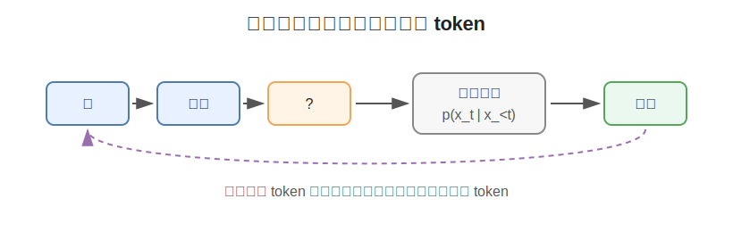
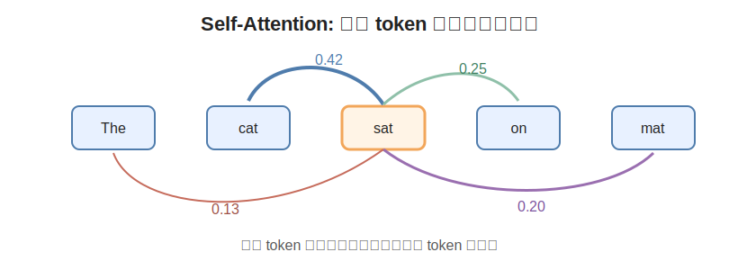
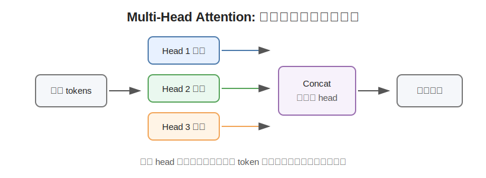
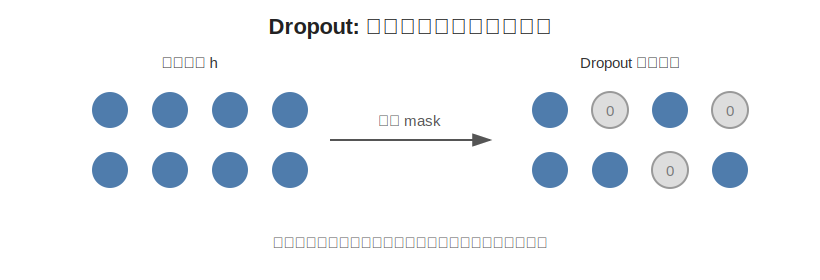
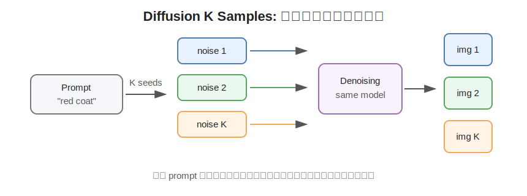
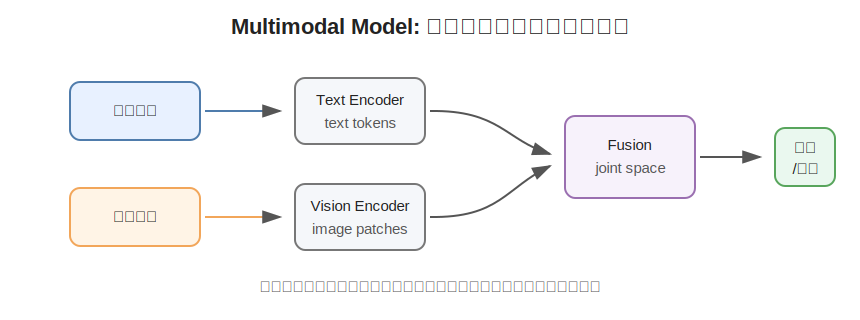

# Large Model Concepts: 大模型阶段常见概念

> **定位**：整理大语言模型、扩散模型、多模态模型和 Transformer 中高频出现的基础概念。
>
> **分类标签**：`LLM` `Transformer` `Attention` `Diffusion` `Multimodal Model` `Sampling`

---

## 一句话总结

大模型阶段的很多概念，本质上是在回答三个问题：模型如何读上下文、如何生成内容、如何在文本/图像/语音等模态之间建立联系。

---

## 一、自回归模型 Autoregressive Model

### 1. 它是什么

自回归模型就是“前面已经出现的内容，会作为后面预测的条件”。在语言模型里，它根据前面的 token 预测下一个 token。

完整公式：

$$
p(x_1, x_2, ..., x_T)
=
\prod_{t=1}^{T}
p(x_t \mid x_1, x_2, ..., x_{t-1})
$$

语言模型训练时常写成负对数似然：

$$
\mathcal{L}_{\text{LM}}
=
-
\sum_{t=1}^{T}
\log
p_\theta(x_t \mid x_{<t})
$$

### 2. 适用场景与应用场景

- **大语言模型生成**：GPT、Qwen、LLaMA 等 decoder-only LLM 都是典型自回归模型；
- **代码补全**：根据已有代码预测下一段代码；
- **对话系统**：根据历史对话逐 token 生成回复；
- **图像 token 生成**：部分视觉生成模型会把图像离散成 token，再自回归生成。

### 3. 直觉图



每一步只预测一个 token，但下一步会把前面已经生成的 token 一起作为上下文。

### 4. Python 伪代码

```python
def autoregressive_generate(model, tokenizer, prompt, max_new_tokens=20):
    tokens = tokenizer.encode(prompt)

    for _ in range(max_new_tokens):
        logits = model(tokens)
        next_token_logits = logits[-1]
        next_token = next_token_logits.argmax()
        tokens.append(next_token)

        if next_token == tokenizer.eos_token_id:
            break

    return tokenizer.decode(tokens)
```

---

## 二、大语言模型 LLM

### 1. 它是什么

大语言模型通常指在大规模文本 / 代码语料上预训练的语言模型。主流 LLM 使用 Transformer decoder-only 架构，通过 next-token prediction 学习语言、知识、推理和代码能力。

训练目标：

$$
\mathcal{L}_{\text{NLL}}
=
-
\sum_{t=1}^{T}
\log
p_\theta(x_t \mid x_{<t})
$$

### 2. 适用场景与应用场景

- **问答与对话**：知识问答、客服、学习助手；
- **代码生成**：代码补全、单元测试、重构建议；
- **文本处理**：摘要、翻译、改写、信息抽取；
- **Agent 工作流**：规划步骤、调用工具、读取文件、执行任务；
- **RAG 系统**：结合检索结果回答专业问题。

### 3. 直觉理解

LLM 的基础能力来自“预测下一个 token”，但当数据和模型规模足够大时，预测任务会压缩进很多隐含能力：语法、事实、格式、推理模式、代码结构和人类指令习惯。

---

## 三、自注意力 Self-Attention

### 1. 它是什么

自注意力让序列中的每个 token 都可以根据需要去“看”其他 token。它不是固定看附近窗口，而是通过注意力权重动态决定哪些位置更重要。

给定输入矩阵 $X$：

$$
Q = XW_Q,\quad
K = XW_K,\quad
V = XW_V
$$

Scaled dot-product attention：

$$
\text{Attention}(Q, K, V)
=
\text{softmax}
\left(
\frac{QK^T}{\sqrt{d_k}}
\right)
V
$$

其中：

| 符号 | 含义 |
| --- | --- |
| $Q$ | Query，要找什么信息 |
| $K$ | Key，每个 token 提供的匹配索引 |
| $V$ | Value，真正被聚合的信息 |
| $d_k$ | key/query 的维度 |

### 2. 适用场景与应用场景

- **机器翻译**：目标词可以关注源句中的相关词；
- **长文本理解**：模型可以跨很远位置建立联系；
- **代码理解**：函数调用可以关注变量定义、import、上下文逻辑；
- **多模态理解**：文本 token 可以关注图像 patch token。

### 3. 直觉图



每个 token 会根据相关性给其他 token 分配权重，再把对应信息加权汇总。

### 4. Python 代码

```python
import numpy as np

def softmax(x, axis=-1):
    x = x - np.max(x, axis=axis, keepdims=True)
    exp_x = np.exp(x)
    return exp_x / np.sum(exp_x, axis=axis, keepdims=True)

def scaled_dot_product_attention(q, k, v):
    dk = q.shape[-1]
    scores = q @ k.T / np.sqrt(dk)
    weights = softmax(scores, axis=-1)
    return weights @ v, weights
```

---

## 四、多头注意力 Multi-Head Attention

### 1. 它是什么

多头注意力不是只做一次 attention，而是把表示空间切成多个 head，让不同 head 学不同关系。

完整公式：

$$
\text{MultiHead}(Q,K,V)
=
\text{Concat}(\text{head}_1, ..., \text{head}_h)W^O
$$

其中：

$$
\text{head}_i
=
\text{Attention}
\left(
QW_i^Q,
KW_i^K,
VW_i^V
\right)
$$

### 2. 适用场景与应用场景

- **语义关系建模**：某些 head 关注主语和谓语，某些 head 关注指代关系；
- **代码模型**：不同 head 可以关注缩进、变量依赖、函数调用；
- **视觉 Transformer**：不同 head 可以关注局部纹理、全局结构或物体边界；
- **多模态模型**：不同 head 可以分别处理图文对齐、OCR、空间位置等关系。

### 3. 直觉图



单头注意力像只戴一副眼镜看文本；多头注意力像从多个角度同时看，同一层里可以捕捉不同类型的关系。

---

## 五、Transformer 中的 Dropout

### 1. 它是什么

Dropout 是一种正则化方法：训练时随机丢弃一部分激活值，让模型不要过度依赖某些神经元。

训练时可以写成：

$$
\tilde{h}
=
\frac{m \odot h}{1-p},
\quad
m_i \sim \text{Bernoulli}(1-p)
$$

其中 $p$ 是 dropout probability，$m$ 是随机 mask。

### 2. 适用场景与应用场景

- **小数据任务**：减少过拟合；
- **早期 Transformer 训练**：原始 Transformer 在 attention 和 FFN 等位置使用 dropout；
- **下游微调**：当领域数据较少时，dropout 仍可能有帮助；
- **大规模预训练**：现代 LLM 预训练中 dropout 往往很小或直接不用，因为数据规模本身提供了很强的正则化。

### 3. 直觉图



Dropout 的直觉是：训练时不要让网络“背答案”，迫使它学到更分散、更稳健的表示。

### 4. Python 代码

```python
import numpy as np

def dropout(x, p=0.1, training=True):
    if not training or p == 0:
        return x
    mask = (np.random.rand(*x.shape) > p).astype(x.dtype)
    return x * mask / (1 - p)
```

---

## 六、扩散模型中的 K Samples

### 1. 它是什么

在扩散模型或图像生成评测里，K samples 常指：对同一个条件输入生成 $K$ 个候选样本。这里的 $K$ 不是网络层数，而是采样次数。

给定文本条件 $c$，第 $k$ 个样本可以写成：

$$
x_T^{(k)} \sim \mathcal{N}(0, I)
$$

经过同一个 denoising process：

$$
x_0^{(k)}
\sim
p_\theta(x \mid c),
\quad
k = 1,2,...,K
$$

最后得到候选集合：

$$
\mathcal{S}
=
\left\{
x_0^{(1)}, x_0^{(2)}, ..., x_0^{(K)}
\right\}
$$

### 2. 适用场景与应用场景

- **图像生成评测**：同一个 prompt 生成多张图，再统计 FID、CLIP score 或人工偏好；
- **创作工作流**：一次出多张候选图，人工挑选最好的一张；
- **不确定任务**：prompt 本身有多种合理解释时，K samples 能覆盖更多可能性；
- **编辑任务**：同一个编辑指令生成多个结果，选择身份保持和指令遵循都好的版本。

### 3. 直觉图



同一个 prompt 不同随机噪声种子，会走出不同生成轨迹，因此结果会有差异。

### 4. Python 伪代码

```python
def generate_k_samples(pipeline, prompt, k=4):
    images = []
    for seed in range(k):
        image = pipeline(prompt=prompt, seed=seed)
        images.append(image)
    return images
```

---

## 七、多模态模型 Multimodal Model

### 1. 它是什么

多模态模型指同时处理两种或多种模态的模型，例如文本、图像、语音、视频、深度图、表格等。常见做法是把不同模态都变成 token / embedding，再让模型在统一空间里对齐和推理。

一个抽象形式是：

$$
z_{\text{text}} = f_{\text{text}}(x_{\text{text}})
$$

$$
z_{\text{image}} = f_{\text{image}}(x_{\text{image}})
$$

然后通过对齐或融合模块得到：

$$
z_{\text{joint}}
=
g(z_{\text{text}}, z_{\text{image}})
$$

### 2. 适用场景与应用场景

- **图文问答**：输入图片和问题，输出文字答案；
- **OCR 与文档理解**：同时理解文字内容和版面结构；
- **图像编辑**：用文本指令编辑图像；
- **视频理解**：结合画面、字幕、声音做事件理解；
- **具身智能**：把视觉观察、语言指令和动作空间结合。

### 3. 直觉图



多模态模型的核心不是简单拼接输入，而是让不同模态在同一个语义空间里可以互相解释。

---

## 八、概念关系速查

| 概念 | 解决的问题 | 常见模型 / 场景 |
| --- | --- | --- |
| Autoregressive Model | 如何逐步生成序列 | GPT、Qwen、LLaMA |
| LLM | 如何从大规模文本中学习通用语言能力 | ChatGPT、Qwen、LLaMA |
| Self-Attention | token 之间如何动态建立关系 | Transformer |
| Multi-Head Attention | 如何从多个角度建模关系 | Transformer、ViT、多模态模型 |
| Dropout | 如何减少过拟合 | 小数据训练、微调 |
| K Samples | 如何从生成模型中获得多个候选 | Diffusion、图像生成评测 |
| Multimodal Model | 如何融合文本、图像、语音等信息 | CLIP、BLIP、GPT-4V 类模型 |

---

## 参考

- Vaswani et al., 2017. [Attention Is All You Need](https://arxiv.org/abs/1706.03762)：Transformer、自注意力、多头注意力的基础论文。
- Srivastava et al., 2014. [Dropout: A Simple Way to Prevent Neural Networks from Overfitting](https://jmlr.org/papers/v15/srivastava14a.html)：Dropout 经典论文。
- Bengio et al., 2003. [A Neural Probabilistic Language Model](https://www.jmlr.org/papers/v3/bengio03a.html)：神经语言模型早期代表工作。
- Brown et al., 2020. [Language Models are Few-Shot Learners](https://arxiv.org/abs/2005.14165)：GPT-3 与大规模自回归语言模型。
- Ho et al., 2020. [Denoising Diffusion Probabilistic Models](https://arxiv.org/abs/2006.11239)：扩散模型基础。
- Radford et al., 2021. [Learning Transferable Visual Models From Natural Language Supervision](https://arxiv.org/abs/2103.00020)：CLIP 与图文对齐。
